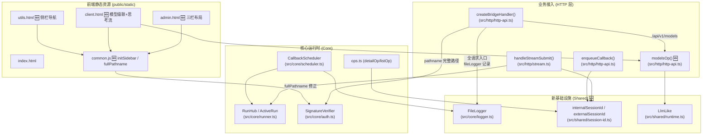
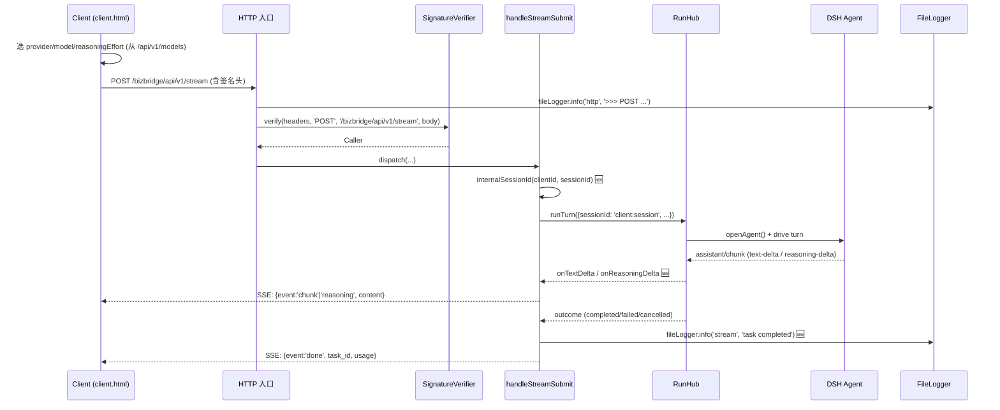

<markdown_report>
## 1. High-Level Summary (TL;DR) 🐛✨

*   **影响等级**：**中-高** — 本次改动横跨**核心安全修复**、**新功能引入**、**前端重构**与**文档体系重塑**，是一个相对完整的"小版本"演进。
*   **关键变更**：
    1.  🛡️ **会话命名空间隔离**（修复多 client 串台隐患）：内部 `session_id` 自动加 `clientId:` 前缀，对外保持原值
    2.  📝 **新增 FileLogger 文件日志模块**：按天轮转，与 `task_logs` 表分离，专为运维排错设计
    3.  🤖 **新增 `/api/v1/models` 接口 + 前端级联下拉**：调用方可从 DSH 运行时动态读取 provider / model / reasoning efforts
    4.  💭 **流式响应新增 `reasoning` 事件**：透传思考型模型（如 `deepseek-reasoner`）的推理过程
    5.  🔐 **签名协议口径修正**：明确签名串中 `REQUEST_PATH` 须为**完整 pathname**（含 `/bizbridge` 前缀）
    6.  🎨 **前端三栏布局重构**（sidebar + content + 固定右侧签名栏）

---

## 2. Visual Overview (Code & Logic Map)



**业务流：流式任务提交 → 推理过程**



---

## 3. Detailed Change Analysis

### 3.1 🛡️ 会话 ID 命名空间隔离（核心安全修复）

**新增模块**：`src/shared/session-id.ts`

| 函数 | 作用 |
|------|------|
| `internalSessionId(clientId, sessionId)` | 在内部加 `clientId:` 前缀，防止多 client 撞 session |
| `externalSessionId(internalId)` | 还原对外 session_id（响应体/回调体中暴露给调用方） |

**应用位置**（关键文件）：

| 文件 | 应用点 |
|------|--------|
| `src/http/stream.ts` | 入库、busy 预检、openAgent、runTurn、cancel 全部改用 `sid = internalSessionId(...)` |
| `src/http/http-api.ts` | `enqueueCallback` 入库改用 `sid` |
| `src/core/scheduler.ts` | 回调体返回给调用方时用 `externalSessionId()` |
| `src/core/ops.ts` | `summarize` / `detailOp` 返回时用 `externalSessionId()` |

> ⚠️ **关键设计点**：调用方始终看到原始 `session_id`（外部口径），服务端内部 DSH agent 看到的是 `client:session`（隔离口径）。这样保证两个不同 client 提交 `session_id="sess-1"` 互不影响。

---

### 3.2 📝 FileLogger 运行日志（新增运维能力）

**新增文件**：`src/core/logger.ts`（96 行）

| 配置项 | 缺省值 | 说明 |
|--------|--------|------|
| `logging.path` | `"./logs"` | 日志目录；建议绝对路径；自动创建父目录 |

**特性**：
- 按天轮转：文件名 `dsh_biz_bridge_{yyyymmdd}.log`
- 写入格式：`[ISO时间] [LEVEL] [模块] 消息 {JSON附加数据}`
- 写入失败兜底：写 console.error 避免静默丢失
- 与 `task_logs` 表分离（业务级任务日志 vs 插件级运维日志）

**核心插入点**（`fileLogger.info/warn/error`）：

| 模块 | 关键日志点 |
|------|-----------|
| `src/index.ts` | 启动 / 路由注册 / reaper / 卸载 |
| `src/http/http-api.ts` | 全请求入口 `>>>` / 验签成功 `<<<` / 验签失败 `<<< FAIL`（脱敏 headers） |
| `src/http/stream.ts` | 任务创建 / agent 打开 / SSE 启动 / 任务完成/失败/取消 |
| `src/core/scheduler.ts` | 候选调度 / 任务 claimed / 失败 / 完成 / 重试 |
| `src/core/ops.ts` | (经 `summarize` 间接使用 `externalSessionId`) |

**新增脱敏函数**（`http-api.ts`）：

```typescript
sanitizeHeaders(): X-Signature / Cookie → "***"
sanitizeBody():  publicKey / privateKey → "***"
                 prompt 超过 50 字符截断 + "…"
```

---

### 3.3 🤖 新增 `/api/v1/models` 动态模型查询

**新增端点**：`POST /api/v1/api/v1/models`（handler 在 `src/http/http-api.ts` 的 `modelsOp()`）

**响应体**（参见 `docs/api.md` §10）：

```json
{
  "providers": [
    {
      "id": "deepseek", "name": "DeepSeek",
      "models": [
        { "id": "deepseek-chat", "name": "...", "description": "...",
          "inputModalities": ["text"],
          "reasoningEfforts": [{"id":"low","name":"低"}, ...],
          "defaultMaxTokens": 4096 }
      ]
    }
  ]
}
```

**实现细节**：
- 注入 `ctx.llm` 服务（`src/index.ts` 的 `inject` 数组加入 `'llm'`）
- `runtime.llm.listProviders()` / `listModels(provider)` / `resolveModelInfo(provider, model)`
- 单模型 `resolveModelInfo` 失败时**降级为 null**，不影响整体返回

**前端配套**（`public/static/client.html`）：
- 新增 `loadModels()` 函数 + `btnLoadModels` 刷新按钮
- `populateProviderSelect` / `populateModelSelect` / `populateEffortSelect` 三个填充函数
- `wireProviderModelEffort(prefix)`：provider → model → reasoningEffort 级联下拉
- 替换原 `parseParams` 自由文本 JSON 输入为表单驱动

---

### 3.4 💭 流式响应新增 `reasoning` 事件

**后端变更**（`src/core/runner.ts` + `src/http/stream.ts`）：

| 改动点 | 内容 |
|--------|------|
| `RunConfig` | 新增 `onReasoningDelta?: (text: string) => void` 回调 |
| `ActiveRun` | 新增 `hasTextDelta` 标志位 |
| `assistant/chunk` 分支 | 新增 `chunk.type === 'reasoning-delta'` 分支，调用 `onReasoningDelta` |
| `assistant/message` 兜底 | 若未收到 text-delta（纯推理模型），在此推送最终文本 |
| `stream.ts` | 新增 `onReasoningDelta` 处理器，发 SSE `{event:'reasoning', content}` |

**前端展示**（`client.html`）：
- 监听 `frame.event === 'reasoning'`
- 显示为 `[思考] <内容>` 前缀

---

### 3.5 🔐 签名协议：`REQUEST_PATH` 完整路径口径

**之前**：`REQUEST_PATH = 仅 pathname`（不含 `/bizbridge` 前缀）  
**现在**：`REQUEST_PATH = 完整 pathname`（**含 `/bizbridge` 前缀**）

| 文件 | 改动 |
|------|------|
| `src/core/auth.ts` | 文档注释明确"完整 pathname（含插件前缀）" |
| `public/static/common.js` | 新增 `fullPathname(baseUrl, path)` 工具函数；`request()` 和 `sseRequest()` 都调用它生成签名串 |
| `docs/api.md` | 新文档 §签名协议 详尽描述并附示例 |

**关键代码**（`common.js`）：
```js
function fullPathname(baseUrl, path) {
  const base = new URL(baseUrl)
  return path.charAt(0) === '/' ? base.pathname.replace(/\/$/, '') + path : path
}
```

> ⚠️ 这是**已部署客户端的破坏性变更**：旧客户端只签 `path`（不含前缀），服务端验签会失败（401）。需要客户端同步升级 `common.js` 或在签名生成时显式拼上前缀。

---

### 3.6 🎨 前端三栏布局重构

**布局结构**（`style.css` 新增）：

```
┌─────────────────────────────────────────────────┐
│ header.site (sticky top:0)                       │
├──────────┬──────────────────────────┬────────────┤
│ .sidebar │ .content                 │ .auth-right│
│ 170px    │ flex:1                   │ 320px      │
│ sticky   │ 多 section.panel         │ sticky     │
│ top:50px │                          │ 签名卡(黄) │
└──────────┴──────────────────────────┴────────────┘
```

**新增通用函数**（`common.js`）：
- `B.initSidebar(sidebarSelector, sectionSelector)`：侧栏 + section 显隐联动

**应用页面**：
- `admin.html` / `client.html`：三栏（含右侧签名卡）
- `utils.html` / `index.html`：两栏（侧栏 + 内容）
- 响应式：窄屏 ≤900px 时侧栏隐藏、签名栏变静态

**client.html 额外改动**：
- 模型参数由 JSON 文本框 → 表单（provider/model/reasoningEffort/maxTokens）
- 流式输出区增加 `reasoning` 事件展示
- 签名面板移至右侧，Base URL 输入框改为**占位提示**（不再硬编码 3080）

---

### 3.7 📚 文档体系重构

| 文档 | 变更 |
|------|------|
| `README.md` | 调整目录结构（`.` 为根）；指向 `docs/api.md` 新文档；删除 `examples/dsh-profile/` 引用 |
| `docs/config.md` | 重写为"配置与部署"专题；删除签名协议/HTTP 接口章节（迁移到 `api.md`）；新增 FAQ；新增 `webServer` / `logging` 章节；DB 路径从 `dsh_bridge.db` → `dsh_biz_bridge.db` |
| `docs/api.md` 🆕 | 521 行全新文档：10 个接口的字段级参考、签名协议、错误码全集、状态流转图 |
| `docs/cordis.patch.yml` 🆕 | 从 `examples/dsh-profile/` 迁入；DB 路径更新；新增 `logging.path` |
| `examples/dsh-profile/README.md` ❌ | 删除（合并到 `docs/config.md`） |
| `examples/dsh-profile/cordis.patch.yml` ❌ | 删除（迁移到 `docs/cordis.patch.yml`） |

**静态资源配置**（`http-api.ts` 的 `serveStatic`）：
- 新增 `cache-control: no-cache` 头，避免浏览器缓存过时 HTML/JS

---

### 3.8 🗃️ 数据库 / Schema 命名调整

| 旧 | 新 |
|----|----|
| `./data/dsh_bridge.db` | `./data/dsh_biz_bridge.db` |

涉及 `src/config/config.ts` 的 `DEFAULTS.database.path` 和 `src/index.ts` 的 zod schema。

> ⚠️ 已部署的 SQLite 文件**不会自动迁移**；如需保留旧数据，需手动 rename 或迁移。

---

### 3.9 📦 发布产物

- `release/dsh-biz-bridge-0.1.0.tgz`（二进制）已重新打包（diff 显示二进制内容有变化）

---

## 4. Impact & Risk Assessment

### ⚠️ Breaking Changes（破坏性变更）

| 编号 | 变更 | 影响面 | 风险 |
|------|------|--------|------|
| 1 | 签名协议：REQUEST_PATH 须含完整前缀 `/bizbridge` | 所有旧客户端 | 🔴 高 — 旧客户端调用全部 401 |
| 2 | DB 文件名 `dsh_bridge.db` → `dsh_biz_bridge.db` | 已有部署 | 🟡 中 — 旧数据需手动迁移；缺省路径无影响 |
| 3 | `examples/dsh-profile/` 目录删除 | 引用该路径的文档/脚本 | 🟢 低 — README 已同步更新 |
| 4 | 新增 `inject: [..., 'llm']` | 插件依赖 DSH 暴露 `ctx.llm` | 🟡 中 — 低版本 DSH 宿主可能无 `llm` 注入，会注入失败 |

### 🟢 新增能力

| 编号 | 能力 | 说明 |
|------|------|------|
| 1 | `POST /api/v1/models` | 业务方可动态查询可用模型 |
| 2 | SSE `reasoning` 事件 | 思考型模型可观察推理过程 |
| 3 | 文件日志（按天轮转） | 运维排错能力提升 |
| 4 | 静态资源 `no-cache` | 部署新版本无需手动清缓存 |
| 5 | 前端三栏布局 | 长内容下体验显著改善 |
| 6 | 侧栏导航（`initSidebar`） | 页面分节更清晰 |

### 🛡️ 风险缓解

| 风险 | 缓解措施 |
|------|----------|
| `resolveModelInfo` 失败 | 单模型 try/catch 降级为 null，整体仍返回 |
| 日志写失败 | 走 `console.error` 兜底，不影响主流程 |
| `clientId` 含 `:` 字符 | `indexOf(SEPARATOR)` 取**第一个** `:` 切分，外部 session_id 仍可含 `:`（虽然现有 ID 规则不允许）|
| `fileLogger` 在静态资源 `serveStatic` 路径上**未**记录 | 静态资源属于免签名入口，仅在错误返回 404 时记录（无）—— 建议后续补全 |

### 🧪 Testing Suggestions（测试建议）

1.  ✅ **签名协议回归**：用旧版 `common.js` 调 `/api/v1/stream`，应返回 401（已破坏）；升级 `common.js` 后应通过
2.  ✅ **会话隔离**：A 客户端提交 `session_id="s1"`，B 客户端同时提交 `session_id="s1"`，互不冲突，响应体中 `session_id` 仍为 `s1`
3.  ✅ **reasoning 流**：用 `deepseek-reasoner` 跑流式，前端应看到 `[思考] ...` 灰色行
4.  ✅ **模型查询**：调 `/api/v1/models`，验证返回 `reasoningEfforts` 与 `defaultMaxTokens` 正确
5.  ✅ **文件日志**：检查 `logging.path` 目录下生成 `dsh_biz_bridge_YYYYMMDD.log`，跨天文件切换
6.  ✅ **前端三栏**：窄屏（≤900px）下侧栏隐藏、签名栏变静态
7.  ✅ **脱敏**：故意提交带 `X-Signature` 的请求触发 401，确认日志中签名被替换为 `***`
8.  ✅ **DB 迁移**：旧 `dsh_bridge.db` 是否需手动重命名

---

## 5. Quick Reference · 关键文件一览

| 模块 | 文件 | 关键改动 |
|------|------|----------|
| 配置 | `src/config/config.ts` | `logging.path` 缺省 + 校验 |
| 配置 | `src/index.ts` | `Config` schema 加入 `logging`；`inject` 加 `'llm'`；构造 `FileLogger` |
| 共享 | `src/shared/session-id.ts` 🆕 | 内部/外部 session_id 互转 |
| 共享 | `src/shared/runtime.ts` | `LlmLike` 接口 + `runtime.llm` / `runtime.fileLogger` |
| 核心 | `src/core/logger.ts` 🆕 | `FileLogger` 类（按天轮转） |
| 核心 | `src/core/auth.ts` | 文档注释明确完整 pathname |
| 核心 | `src/core/runner.ts` | `onReasoningDelta` 回调 + `hasTextDelta` 兜底 |
| 核心 | `src/core/ops.ts` | 输出用 `externalSessionId()` |
| 核心 | `src/core/scheduler.ts` | 大量 `fileLogger.*` 记录 + 回调体 `externalSessionId` |
| HTTP | `src/http/http-api.ts` | `modelsOp` + 入口日志 + 脱敏 + `static no-cache` |
| HTTP | `src/http/stream.ts` | `internalSessionId` + `onReasoningDelta` + 日志 |
| 前端 | `public/static/common.js` | `initSidebar` + `fullPathname` + 默认 Base URL 自适应 |
| 前端 | `public/static/admin.html` | 三栏布局 + 侧栏导航 |
| 前端 | `public/static/client.html` | 三栏 + 模型级联下拉 + reasoning 展示 |
| 前端 | `public/static/utils.html` | 两栏布局 + 侧栏导航 |
| 前端 | `public/static/style.css` | 三栏/两栏布局样式 + 响应式 |
| 文档 | `README.md` | 目录调整、链接更新 |
| 文档 | `docs/config.md` | 重写为"配置与部署" |
| 文档 | `docs/api.md` 🆕 | 521 行完整 API 文档 |
| 文档 | `docs/cordis.patch.yml` 🆕 | 从 `examples/` 迁入 + `logging.path` |
| 删除 | `examples/dsh-profile/*` | 内容已合并至 `docs/` |