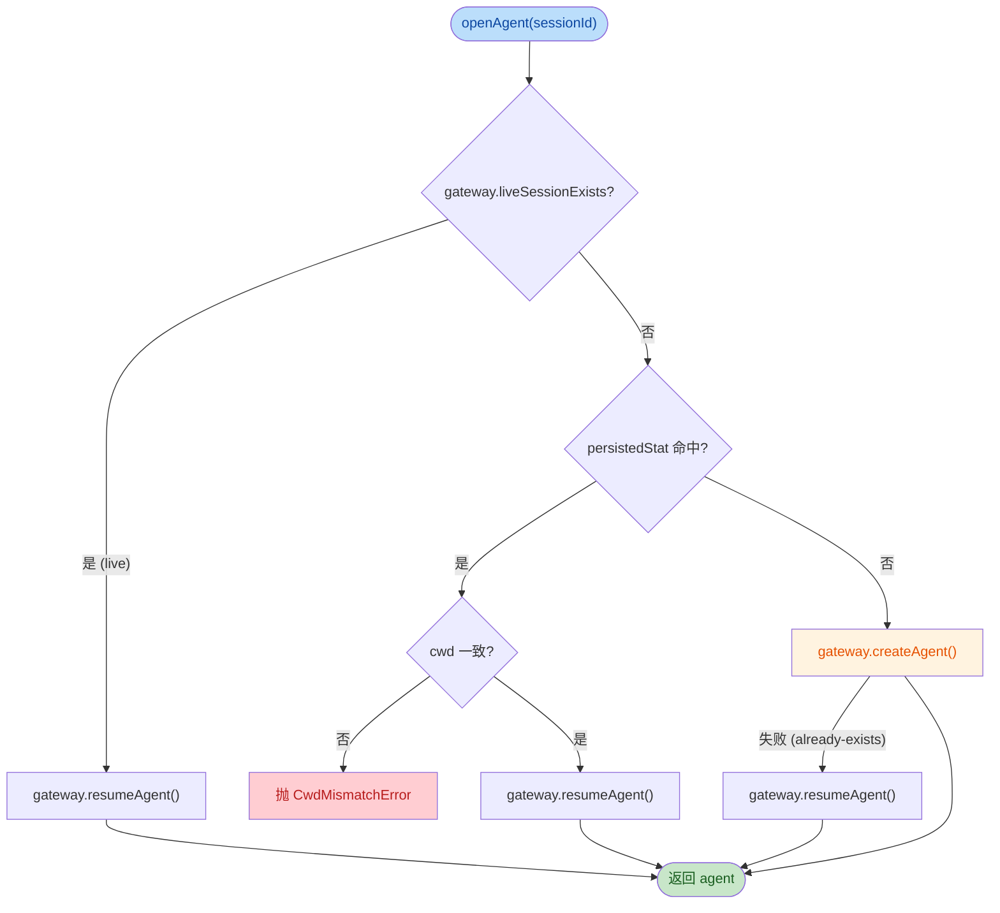
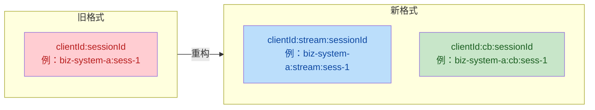
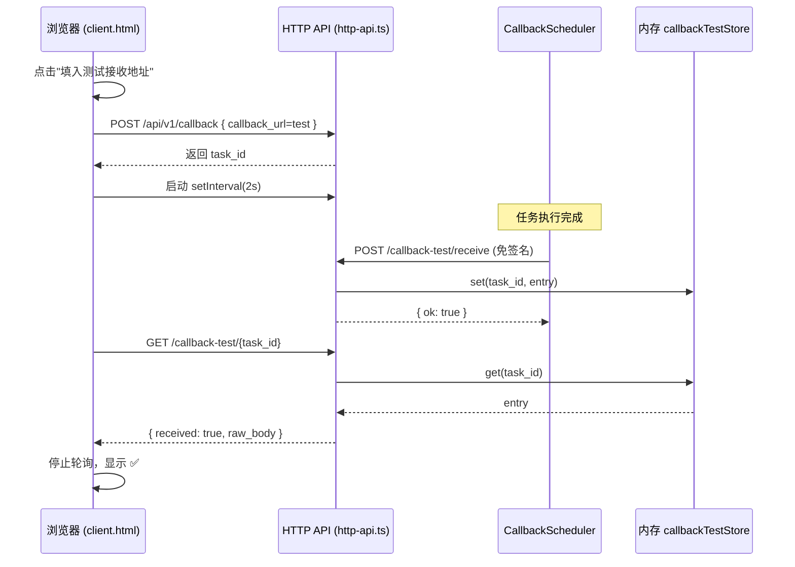

## 1. 高层摘要 (TL;DR)

*   **影响程度：** ⚠️ **中-高** — 本次变更是一次**架构精简 + 新增调试能力**的混合提交：移除自管 Agent 生命周期、引入 stream/callback 会话命名空间隔离、新增会话消息查询与端到端回调测试基建。
*   **核心变更：**
    *   🧹 **取消 Agent 自管生命周期**：删除 `AgentPool` 的 handle 注册表、空闲回收、并发激活去重、批量 dispose；改由 DSH 内部统一管理。
    *   🔗 **会话 ID 三段式命名空间**：内部 ID 从 `clientId:sessionId` 改为 `clientId:type:sessionId`，stream 与 callback 互不阻塞。
    *   💾 **`task_results` 大文本分表存储**：避免 result 膨胀污染 `tasks` 主表热路径查询。
    *   🆕 **会话消息查询 API**：新增 `POST /api/v1/sessions/{id}/messages`（admin 权限）。
    *   🧪 **回调端到端测试端点**：新增内存存储的 `/callback-test/receive` 与 `/callback-test/{id}`，前端可视化追踪回调到达。

---

## 2. 可视化总览

### 2.1 新版 Agent 打开流程（精简后）



> 💡 对比：旧版包含 `handles` Map、`activating` 去重 Map、`reapIdle()` 扫描、`pruneDisposed()`、`disposeAll()`；新版**完全交由 DSH**，本桥接仅保留 `activity` Set 做串行守卫。

### 2.2 内部会话 ID 三段式结构



### 2.3 回调端到端测试时序



---

## 3. 详细变更分析

### 3.1 📐 配置层精简（移除 `agent.idleTimeout`）

**涉及文件：** `src/config/config.ts`、`src/index.ts`、`docs/config.md`、`docs/cordis.patch.yml`

| 变更点 | 旧 | 新 | 说明 |
|--------|----|----|------|
| `ResolvedConfig.agent` | `{ idleTimeout: number }` | **已移除** | Agent 生命周期交给 DSH |
| `DEFAULTS.agent` | `{ idleTimeout: 10 }` | **已移除** | 无默认配置项 |
| `Config` schema | 含 `agent` 子对象 | **已移除** | cordis zod 校验不再需要 |
| `normalizeConfig` 返回 | 含 `agent` 字段 | **已移除** | |
| `AgentPool` 构造参数 | `(gateway, idleMinutes, clock?)` | **`(gateway)`** | 减少两个参数 |

> ⚠️ **配置破坏性变更**：升级前请确认 `cordis.patch.yml` 中已删除 `agent.idleTimeout`（本次同步删除）。

---

### 3.2 🔗 会话 ID 命名空间隔离

**涉及文件：** `src/shared/session-id.ts`、`src/http/http-api.ts`、`src/http/stream.ts`

| 函数 | 旧签名 | 新签名 |
|------|--------|--------|
| `internalSessionId()` | `(clientId, sessionId)` | `(clientId, sessionId, type: 'stream' \| 'cb')` |
| `externalSessionId()` | 取**第一个**冒号后 | 取**最后一个**冒号后 |

**影响：** stream 任务和 callback 任务即使 `clientId + sessionId` 相同也不会互相冲突；`externalSessionId()` 从 `indexOf` 改为 `lastIndexOf` 以适配三段式结构。

**调用点更新：**
*   `src/http/stream.ts:68` → 传 `'stream'`
*   `src/http/http-api.ts:296` (`enqueueCallback`) → 传 `'cb'`

---

### 3.3 💾 数据库：`task_results` 分表 + 过期清理

**涉及文件：** `src/core/db.ts`、`src/index.ts`

#### 3.3.1 新增 `task_results` 表

| 字段 | 类型 | 说明 |
|------|------|------|
| `task_id` | TEXT PRIMARY KEY | 外键引用 `tasks(id)` |
| `result` | TEXT NOT NULL | 大文本 result，独立存储 |
| `created_at` | TEXT NOT NULL | 写入时间 |

```sql
CREATE TABLE IF NOT EXISTS task_results (
  task_id    TEXT PRIMARY KEY REFERENCES tasks(id),
  result     TEXT NOT NULL,
  created_at TEXT NOT NULL
);
```

**写入路径：** `completeTask()` 在更新 `tasks` 表后调用 `INSERT OR REPLACE INTO task_results`（仅当 `result !== ''`）。
**读取路径：** 新增 `db.getTaskResult(taskId)` 方法。

#### 3.3.2 新增 `cleanupExpired(retentionDays = 90)`

*   扫描 `created_at < cutoff` 且状态为 `completed / failed / callback_failed / cancelled` 的任务
*   **先删子表** (`task_logs` + `task_results`) → 再删主表 (`tasks`)，避免外键约束问题
*   温和回收：`PRAGMA incremental_vacuum`（失败忽略）
*   **触发时机：**
    *   激活时立即执行一次
    *   每 24 小时定时执行一次（替代旧 30s 空闲回收扫描）

#### 3.3.3 受影响的查询接口

| 接口 | 旧 `result` 来源 | 新 `result` 来源 |
|------|------------------|------------------|
| `detailOp()` | `task.result` | **`db.getTaskResult(taskId)`** |
| `buildCallbackPayload()` | `row.result` | **`runtime.db.getTaskResult(row.id)`** |

---

### 3.4 🧹 Agent 生命周期交由 DSH

**涉及文件：** `src/core/session-bridge.ts`、`src/core/runner.ts`、`src/index.ts`

#### 3.4.1 `AgentPool` 移除的方法/字段

| 移除项 | 用途 | 影响 |
|--------|------|------|
| `handles: Map<string, OwnedEntry>` | 本地持有 agent handle | ❌ 不再持有，DSH 内部缓存 |
| `activating: Map<string, Promise>` | 并发激活去重 | ❌ 每次 `openAgent` 都走 gateway |
| `idleTimeoutMs` + `clock()` | 空闲回收判据 | ❌ 回收功能移除 |
| `owns()` / `size()` / `disposeAll()` | 诊断/卸载 | ❌ 全部移除 |
| `touch()` | 刷新 lastActivity | ❌ 移除（`ActivityController.touch` 也移除） |
| `reapIdle()` | 空闲回收扫描 | ❌ 移除 |
| `pruneDisposed()` | 监听 `agent/disposed` | ❌ 移除监听 |

#### 3.4.2 保留的方法

*   `beginActivity(sessionId)` / `endActivity(sessionId)` — 流式 409 与调度器串行守卫
*   `isBusy(sessionId)` — 会话忙查询
*   `openAgent(sessionId, options)` — 决策流（**始终走 gateway**）

#### 3.4.3 启动/卸载流程对比

| 阶段 | 旧 | 新 |
|------|----|----|
| 启动 | `db.open` → `rescueProcessing` | + `cleanupExpired()` 立即清理 |
| 定时任务 | 30s 空闲回收 | 24h 过期数据清理 |
| `session/event` 监听 | `hub.onSessionEvent` + **`pool.touch`** | 仅 `hub.onSessionEvent` |
| `agent/disposed` 监听 | `pool.pruneDisposed` | **移除** |
| 卸载 | `cancelAll` → `pool.disposeAll` → `db.close` | `cancelAll` → `db.close` |

---

### 3.5 🆕 HTTP 新端点

**涉及文件：** `src/http/http-api.ts`、`src/core/ops.ts`、`src/shared/runtime.ts`

#### 3.5.1 `POST /api/v1/sessions/{id}/messages`（需签名 + admin scope）

```ts
// src/core/ops.ts 新增
export async function sessionMessagesOp(
  sessionQuery: SessionQueryLike,
  sessionId: string,
  caller: Caller,
  body: { page?: number; page_size?: number }
): Promise<{ session_id, total, page, page_size, messages[] }>
```

*   通过注入的 `sessionQuery` 服务读取 DSH 完整 session 事件流
*   `projectMessages()` 投影 `user/message` + `assistant/message` 事件，提取 `text` 类型 content 块
*   字段：`role`、`content`、`usage`、`seq`、`timestamp`
*   **未注入 `sessionQuery` 时返回 501 `NOT_IMPLEMENTED`**

#### 3.5.2 `POST /api/v1/callback-test/receive`（**免签名**）

*   内存存储：`Map<task_id, CallbackTestEntry>`（30 分钟 TTL 自动清理）
*   字段：`task_id`、`biz_id`、`status`、`result`、`received_at`、`raw_body`
*   **响应：** `{ ok: true, task_id, received_at }`

#### 3.5.3 `GET/POST /api/v1/callback-test/{task_id}`（需签名）

*   未到达：`{ task_id, received: false }`
*   已到达：`{ task_id, received: true, ...entry }`

#### 3.5.4 注入服务清单变更

```ts
// 旧：['agents', 'sessions', 'sessionPersistence', 'webServer', 'llm']
// 新：['agents', 'sessions', 'sessionPersistence', 'webServer', 'llm', 'sessionQuery']
```

---

### 3.6 📝 前端页面

#### 3.6.1 `public/static/admin.html` — 新增"会话消息查询"面板

*   侧边栏新增 `<a href="#sec-session">会话消息</a>`
*   新增 `<section id="sec-session">`：含 `Session ID`、`页码`、`每页` 输入 + `renderSessionMessages()` 渲染（带 emoji `👤 user` / `🤖 assistant`）
*   调用：`POST /api/v1/sessions/{sid}/messages`

#### 3.6.2 `public/static/client.html` — 回调调试增强

| 新增 UI | 功能 |
|---------|------|
| `btnCbTestUrl` | 一键填入 `${baseUrl}/api/v1/callback-test/receive` |
| `btnLoadModelsCb` | 回调区"刷新模型"按钮 |
| `cbTracker` 区块 | 显示 task_id + 状态 + 实时结果 |
| `startCbPoll(taskId)` | 每 2 秒轮询 `/callback-test/{id}`，最多 120 次（4 分钟） |

**轮询逻辑：** 检测 `body.callback_url` 包含 `/api/v1/callback-test/receive` 时自动启用追踪；超时则标记 `轮询超时（4 分钟）`。

---

### 3.7 🐛 Runner 兜底收集修复

**涉及文件：** `src/core/runner.ts`

```diff
- // 兜底：若模型未产生 text-delta（纯推理模型），在此推送最终文本
+ // 兜底：若模型未产生 text-delta（纯推理模型或 DSH 版本差异），
+ // 在此推送最终文本并收集到 result 中。
  if (!this.hasTextDelta) {
+   this.collected += text
    this.config.onTextDelta?.(text)
  }
```

**说明：** 当 DSH 版本不发出 `text-delta` 事件、仅在 `assistant/message` 推送最终文本时，会话结果（`collected`）现在也会包含该文本，避免 result 为空。

---

## 4. 影响与风险评估

### 4.1 ⚠️ 破坏性变更清单

| 项目 | 影响 | 升级注意 |
|------|------|----------|
| **`cordis.patch.yml` 中 `agent.idleTimeout`** | 配置 schema 已移除该字段 | 升级前删除该段，否则可能校验失败 |
| **`internalSessionId()` 函数签名** | 第三个参数 `type` 必填 | 第三方调用方需更新 |
| **DB schema** | 新增 `task_results` 表（CREATE IF NOT EXISTS，幂等） | 自动迁移，但旧库的 result 字段会"孤立" |
| **Agent handle 语义** | `owns()` / `size()` / `disposeAll()` 移除 | 调用方需移除依赖 |
| **`ActivityController.touch` 方法** | 已从接口移除 | 实现方需更新 |

### 4.2 🔍 兼容性细节

*   **`task_results` 数据迁移**：旧库的 `tasks.result` 数据不会自动迁移到 `task_results`；升级后旧任务的详情和回调返回的 `result` 将为 `null`（已成功完成的任务）。如需保留历史，建议手动迁移。
*   **DSH 版本差异兜底**：`runner.ts` 新增的 `this.collected += text` 仅在 `hasTextDelta === false` 时生效，常规路径无影响。
*   **会话消息查询依赖注入**：若 DSH 环境未提供 `sessionQuery` 服务，调用会返回 501，不会抛错。

### 4.3 🧪 测试建议

| 测试场景 | 关注点 |
|----------|--------|
| **配置兼容性** | 升级后启动时 `cordis.patch.yml` 中残留 `agent.idleTimeout` 是否报错 |
| **会话命名空间** | 同一 `clientId + sessionId` 并发提交 stream 与 callback，互不阻塞、互不冲突 |
| **过期清理** | 手动构造 91 天前的终态任务，启动插件后是否被清理（`task_logs` + `task_results` + `tasks` 三表） |
| **大 result 性能** | result 文本较大（如 1MB+）时，`tasks` 主表的列表/详情查询是否仍快速 |
| **回调端到端测试** | `client.html` 提交 callback → 4 分钟内能否在追踪面板看到 ✅ |
| **会话消息查询** | admin scope 用户查询有消息/无消息/权限不足三种场景 |
| **Agent 池精简** | 确认 DSH 端能正确复用/创建 agent，无 handle 泄漏（监控 DSH 端 agent 数量） |
| **卸载流程** | 插件热卸载时，`hub.cancelAll` + `db.close` 是否正常，无 `pool.disposeAll` 残留异常 |

### 4.4 📊 变更规模统计

| 类型 | 文件数 | 说明 |
|------|--------|------|
| 源码（TS） | 8 | 配置、DB、Agent 池、Runner、HTTP、Shared、入口 |
| 前端（HTML） | 2 | admin + client 调试页 |
| 文档（MD/YML） | 2 | 配置文档 + cordis patch 模板 |
| **总计** | **12** | （不含二进制 tarball） |