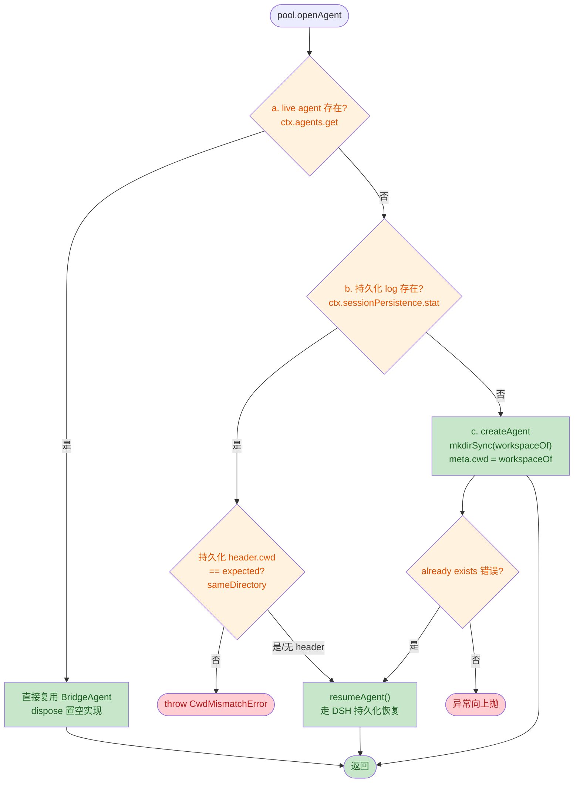
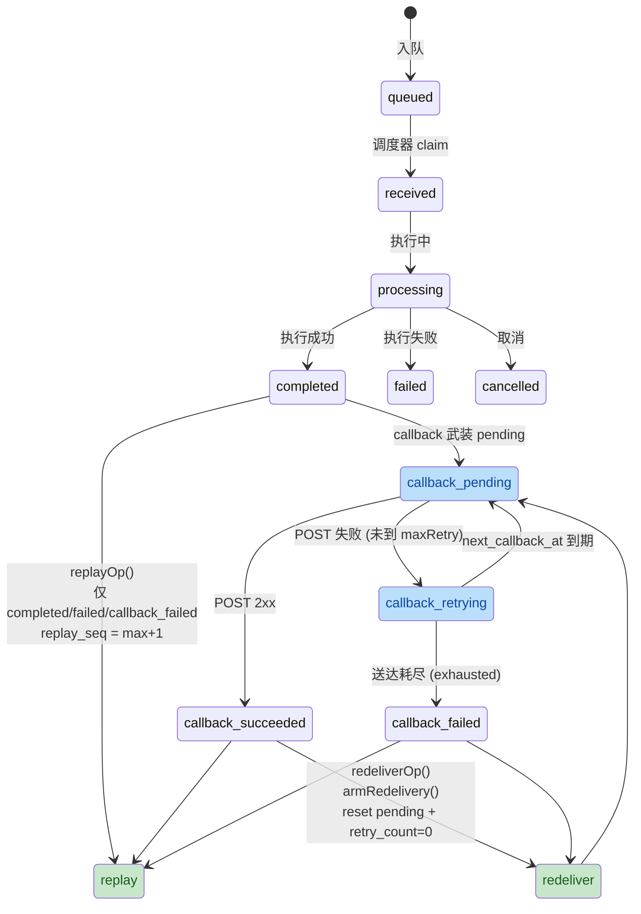

# 🔍 0.1.0修订版本

> 本次变更是一次**破坏性改版**（草创期清理，版本仍为 0.1.0），核心围绕「DSH 0.1.5 事件模型适配」「磁盘布局单一根」「per-client workspace 隔离」「token 用量落库」「新增 redeliver 接口」五大主题，并配套完整的单测与前端 UI 调整。

---

## 1. 📋 High-Level Summary（TL;DR）

| 维度 | 内容 |
|------|------|
| **影响等级** | ⚠️ **High**（含配置 schema 破坏性变更与数据库表结构变更） |
| **核心主题** | DSH 0.1.5 适配 + 磁盘布局重构 + 业务能力扩展 |
| **涉及范围** | 30 个文件（源码 / 测试 / 前端 / 文档 / 构建 / 依赖） |

### 🔑 关键变更（Top 5）

- ✨ **新增 `redeliver` 接口**（`POST /api/v1/tasks/{id}/redeliver`）：对已完成执行的回调任务重新武装送达状态机，业务场景用于"丢回调补救"或"主动重投"。
- 🗂️ **磁盘布局统一为单一 `runtime.path` 根**：移除旧 `database.path` 与 `logging.path`，新增 `<root>/data|logs|workspace/<clientId>/` 自动派生。
- 🔌 **DSH 0.1.5 事件模型适配**：新增 `src/dsh/decode.ts` 解码器，runner 与业务代码完全 DSH 解耦，事件类型归一化为 `text-delta / reasoning-delta / assistant-message / turn-end`。
- 📊 **`tasks.usage` 列取代 result 列的"轻量摘要"角色**：token 用量入表，列表 / 详情 / 回调体三处透出。
- 🛠️ **per-client workspace 会话隔离**：每个业务 client 在 `runtime/workspace/<clientId>/` 下拥有独立的 agent 会话 cwd，断连/恢复时强校验持久化 cwd。

---

## 2. 🗺️ Visual Overview（代码与逻辑地图）

### 2.1 整体架构变更概览

```mermaid
graph LR
  subgraph DSH["DSH 0.1.5 (host)"]
    SE["session/event<br/>(v3 流模型)"]
    AG["ctx.agents.get/.create/.resume"]
    SP["ctx.sessionPersistence.stat"]
  end

  subgraph DECODE["src/dsh/decode.ts<br/>(新增·零 DSH 依赖)"]
    UF["unfoldStream()"]
    EX["extractTextContent()"]
    DEC["decodeSessionEvent()"]
  end

  subgraph RUNNER["src/core/runner.ts<br/>(DSH 解耦归约内核)"]
    HUB["RunHub"]
    ACT["ActiveRun"]
  end

  subgraph GATEWAY["src/dsh/gateway.ts"]
    GW["createSessionGateway()"]
    WS["workspaceOf()"]
  end

  subgraph OPS["src/core/ops.ts"]
    CAN["cancelOp()"]
    REP["replayOp()"]
    RED["redeliverOp()"]
    DET["detailOp()"]
  end

  subgraph DB["src/core/db.ts"]
    TBL["tasks.usage 列"]
    RES["task_results.result"]
    ARM["armRedelivery()"]
    MXS["maxReplaySeq()"]
  end

  subgraph API["src/http/http-api.ts"]
    DIS["dispatch()"]
  end

  SE --> DEC
  DEC -->|TurnEvent[]| HUB
  AG --> GW
  SP --> GW
  GW --> WS
  WS -->|per-client cwd| ACT
  HUB --> ACT
  CAN --> DB
  REP --> MXS
  RED --> ARM
  DET --> TBL
  DET --> RES
  API --> CAN
  API --> REP
  API --> RED

  classDef new fill:#c8e6c9,color:#1a5e20
  classDef changed fill:#bbdefb,color:#0d47a1
  classDef stable fill:#fff3e0,color:#e65100
  class DEC,UF,EX,RED,ARM,MXS,TBL new
  class HUB,GW,WS,CAN,REP,DET,DIS,RES changed
  class SE,AG,SP,ACT stable
```

### 2.2 openAgent 决策流变更（关键路径）



### 2.3 replay / redeliver 状态机



---

## 3. 🔬 Detailed Change Analysis

### 3.1 配置层（Config · Breaking）

> 破坏性变更：移除 `database.path` 与 `logging.path`，新增 `runtime.path`

**📦 改动文件：** `src/config/config.ts`、`src/index.ts`、`docs/config.md`、`docs/cordis.patch.yml`

| 配置键 | 旧版 | 新版 | 说明 |
|--------|------|------|------|
| `runtime.path` | ❌ 不存在 | `"./runtime"` | 单一磁盘根（绝对路径推荐） |
| `database.path` | `"./data/dsh_biz_bridge.db"` | ❌ **移除** | SQLite 固定为 `<runtime>/data/dsh-biz-bridge.db` |
| `database.journalMode` | `"WAL"` | `"WAL"` | 不变 |
| `database.busyTimeout` | `5000` | `5000` | 不变 |
| `logging.path` | `"./logs"` | ❌ **移除** | 运行日志固定为 `<runtime>/logs/` |
| `workspace/<clientId>/` | ❌ 不存在 | 新增 | 各业务 client 独立会话 cwd |

**派生布局（`resolveRuntimeLayout()`）：**

```typescript
export interface RuntimeLayout {
  root: string          // 归一化后磁盘根（绝对）
  dataDir: string       // <root>/data
  logsDir: string       // <root>/logs
  workspaceDir: string  // <root>/workspace
  dbFile: string        // <dataDir>/dsh-biz-bridge.db
}

export function resolveRuntimeLayout(path: string): RuntimeLayout
export function clientWorkspaceDir(workspaceDir: string, clientId: string): string
```

⚠️ **业务影响：** 升级时**必须**将原 `database.path` 与 `logging.path` 值迁到 `runtime.path` 的对应位置（`data/` 与 `logs/` 子目录）。

---

### 3.2 数据库层（DB · Schema & 行为）

**📦 改动文件：** `src/core/db.ts`、`src/shared/types.ts`

#### 3.2.1 `tasks` 表 schema 变更

| 列 | 旧版 | 新版 | 备注 |
|----|------|------|------|
| `result` | `TEXT`（结果全文，热路径查询行） | ❌ **移除** | 结果全文独立存于 `task_results`（已在旧版本存在，本次彻底分离） |
| `usage` | ❌ 不存在 | `TEXT`（JSON） | 最后一次 `assistant/message` 的 token 用量，完成时写入 |
| 其他 22 列 | — | — | 仅补充 `--` 中文注释，无结构变更 |

#### 3.2.2 新增 API

| 方法 | 用途 | 行为 |
|------|------|------|
| `armRedelivery(taskId, now)` | redeliver 原子武装 | `status='completed'`, `callback_status='pending'`, `next_callback_at=now`, `retry_count=0`；仅 `type='callback' AND status IN ('completed','callback_failed') AND callback_url IS NOT NULL` |
| `maxReplaySeq(clientId, bizId)` | 重播序号续号 | 取当前最大 `replay_seq`（无记录为 0），用于 `replay_seq+1` 计算 |
| `completeTask()` 增强 | 写入 `usage` | 新增 `usage` JSON 落 `tasks.usage` 列；无用量时置 NULL |

#### 3.2.3 `TaskRow` 类型同步

```typescript
// src/shared/types.ts
export interface TaskRow {
  // ...
  callback_url: string | null
  /** JSON 字符串或 null；最后一次 assistant/message 的 token 用量 */
  usage: string | null
  // result 已移除（全文走 task_results）
  error_message: string | null
  // ...
}
```

---

### 3.3 业务操作层（Ops · 行为规则）

**📦 改动文件：** `src/core/ops.ts`

#### 3.3.1 cancel（取消）规则变更

| 维度 | 旧版 | 新版 |
|------|------|------|
| 业务级取消 processing | ❌ 抛 `TaskRunningError`(409) | ✅ 允许取消，**会中止 live agent**（`needAgentCancel=true`） |
| 管理级取消 processing | ✅ `needAgentCancel=true` | ✅ `needAgentCancel=true` |
| 终态返回 | 400 `INVALID_REQUEST` | 400 `INVALID_REQUEST`（不变） |
| 越权返回 | 403 `FORBIDDEN` | 403 `FORBIDDEN`（不变） |

#### 3.3.2 replay（重播）规则变更

| 维度 | 旧版 | 新版 |
|------|------|------|
| 可重播状态 | 仅非 queued/received（隐含 completed/processing 等） | **仅已完成处理**：`completed / failed / callback_failed` |
| `replay_seq` 取值 | `原 replay_seq + 1`（旧版本未做修正，存在撞唯一键风险） | `(client_id, biz_id) 当前 MAX(replay_seq) + 1`（重播较旧条目也连续续号） |
| 并发竞争 | 无防护 | **重试 5 次**：撞 `DuplicateBizIdError` 时重算 max seq 再插 |
| stream 任务 | 不允许 | 不允许（不变） |

#### 3.3.3 redeliver（再次触发回调）✨ 新增

```typescript
export function redeliverOp(
  db: BridgeDb,
  taskId: string,
  caller: Caller,
): { task_id: string; status: 'completed'; callback_status: 'pending'; message: string }
```

**约束规则：**

| 条件 | 错误码 |
|------|--------|
| 仅 `callback` 类型 | `type !== 'callback'` → 400 `INVALID_REQUEST` |
| 仅已完成执行 | `status === 'completed'` 或 `status === 'callback_failed'`；其余 → 400 |
| 任务必须含 `callback_url` | 缺 → 400 `INVALID_REQUEST` |
| 越权 | 非 admin 且非任务所属 client → 403 `FORBIDDEN` |
| 调度器下一轮 `pump()` 即重新 POST | 原子 `armRedelivery()` |

#### 3.3.4 summarize / detail 的 usage 透出

- `summarize()`：列表项新增 `usage` 字段（来源 `tasks.usage` 列）。
- `detailOp()`：详情新增 `usage` 字段；`result` 仍从 `task_results` 全文读取。
- 新增 `parseUsage()`：NULL / 非对象 / 非法 JSON 一律按 null（防御性解析）。

---

### 3.4 DSH 适配层（Gateway · 重写）

**📦 改动文件：** `src/dsh/gateway.ts`、🆕 `src/dsh/decode.ts`、`src/core/session-bridge.ts`、`src/core/runner.ts`、`src/index.ts`

#### 3.4.1 新模块：`src/dsh/decode.ts`（DSH 解耦层）

> 这是本次最重要的**架构演进**：把 DSH 事件模型版本变更的爆炸半径从"全业务"压缩到"单文件"。

| 导出 | 作用 |
|------|------|
| `decodeSessionEvent(event: SessionEventLike): TurnEvent[]` | 一条 DSH 事件 → 0..N 条归一化事件，防御性不抛错 |
| `extractTextContent(message)` | 从 `message.content[]` 提取 text 块（不变） |
| `unfoldStream(stream)` | 展开 v3 内嵌 `stream: AssistantStreamRecord[]`（`text-chunks / reasoning-chunks / chunk`）为有序增量 |

**v3 流模型适配要点：**

```typescript
// DSH 0.1.5 v3：assistant/chunk 事件已从 SessionEventMap 移除
// token 增量内嵌在 assistant/message 与 assistant/attempt 的 stream 中
// 解码器展开 stream → text-delta / reasoning-delta，归一化为本模块 TurnEvent

case 'assistant/message':
  events = unfoldStream(data.stream).map(...)   // 增量在前
  if (text !== '' || usage !== null)
    events.push({ type: 'assistant-message', turn, text, usage })  // 全文+usage 在后

case 'assistant/attempt':
  return unfoldStream(data.stream).map(...)     // 仅实时增量，不产 assistant-message
```

#### 3.4.2 新类型：`TurnEvent`（runner 协议）

```typescript
export type TurnEvent =
  | { type: 'text-delta';       turn: number; text: string }
  | { type: 'reasoning-delta';  turn: number; text: string }
  | { type: 'assistant-message'; turn: number; text: string; usage: Record<string, unknown> | null }
  | { type: 'turn-end';         turn: number; reason: TurnEndReasonLike }
```

#### 3.4.3 SessionGateway 接口重写

| 旧版 | 新版 | 说明 |
|------|------|------|
| `liveSessionExists(sessionId): boolean` | `liveAgent(sessionId): BridgeAgent \| undefined` | 改用 `ctx.agents.get`；不再仅查存在性，直接返回桥接面 |
| `currentCwd(): string` | `workspaceOf(sessionId): string` | per-client workspace：`runtime/workspace/<clientId>/` |
| `createAgent(sessionId, opts?)` | 同签名 + `mkdirSync(cwd, { recursive: true })` | 惰性创建 workspace |
| `meta.cwd = process.cwd()` | `meta.cwd = workspaceOf(sessionId)` | 业务隔离边界 |

#### 3.4.4 openAgent 决策流调整

```typescript
// 旧：a. live → resume（撞 already owned），b. persisted → resume + cwd 校验，c. create + already-exists fallback
// 新：a. live → 复用 agents.get（绝不 resume：避免与 live 会话持有的持久写句柄冲突）
//     b. persisted → resume + cwd 校验（expected = workspaceOf(sessionId)）
//     c. create + already-exists fallback → resume
```

#### 3.4.5 Runner 行为微调

- 新增 `onReasoningDelta` 回调（与 `onTextDelta` 平级，但 reasoning **不入 result**，仅 SSE 转发）。
- `handleEvent()` 接收 `TurnEvent`，按 `text-delta / reasoning-delta / assistant-message / turn-end` 分支。
- `completeTask` 时若该 message 无前置 `text-delta`，仍兜底推送全文到 `collected`（与旧语义一致）。
- `AgentPool.isBusy(sessionId)` 取代旧的 owns/dispose/prune 概念（DSH 0.1.5 重构，生命周期由 DSH 管理）。

---

### 3.5 HTTP 路由层

**📦 改动文件：** `src/http/http-api.ts`

- 路由正则新增 `redeliver` 分支：`/^\/bizbridge\/api\/v1\/tasks\/([A-Za-z0-9_-]{1,128})(?:\/(logs|cancel|replay|redeliver|priority))?$/`
- 调度：cancel 日志文案从"管理级取消"改为"调用方取消"（业务级现在也能取消 processing）。
- 调度：cancel 分支后新增 `if (action === 'redeliver')` → `redeliverOp()` + `addLog('callback', result.message, { action: 'redeliver' })`。

---

### 3.6 调度器层

**📦 改动文件：** `src/core/scheduler.ts`

- 移除 `lastCompletedUsage()`（之前从 `task_logs.completed` 元数据反查 usage）。
- 回调 payload 的 `usage` 字段改读 `row.usage`（`tasks.usage` 列），通过新增的 `parseStoredUsage()` 防御性解析。
- 损坏/非法 JSON 不再阻断回调送达（按 null 处理）。

---

### 3.7 前端 UI 层（admin/client/utils/index）

**📦 改动文件：** `public/static/admin.html`、`public/static/client.html`、`public/static/index.html`、`public/static/utils.html`、`public/static/style.css`

#### 3.7.1 操作按钮按状态/类型显隐（与 API 规则对齐）

| 操作 | 旧版（永远显示） | 新版（条件显隐） |
|------|------------------|------------------|
| **取消** | 永远 | `status ∈ {queued, received, processing}` |
| **重播** | 永远 | `type='callback' AND status ∈ {completed, failed, callback_failed}` |
| **再次回调** | ❌ 不存在 | `type='callback' AND status ∈ {completed, callback_failed}` |
| **优先级** | 永远 | `status === 'queued'` |

#### 3.7.2 新增"回调追踪"页（`sec-redeliver`）

- 每 2 秒轮询 `POST /api/v1/callback-test/{id}` 测试接收器，最多 4 分钟（120 次）。
- 自动从"业务级自有任务"列表的"再次回调"操作后**带 task_id 跳转并自动开始观察**。
- 仅对 `callback_url` 指向 `/api/v1/callback-test/receive` 的任务生效。

#### 3.7.3 utils.html 新增"HTTP API 说明"表

完整 14 条接口清单（含路径 / scope / 说明），与 `docs/api.md` 保持一致。

#### 3.7.4 样式增强（`style.css`）

- `button:hover` 统一反馈（边框 + 文字颜色变蓝）。
- `button.danger:hover`：红底白字。
- `label .btn-inline`：行内小按钮（生成 biz_id / 刷新模型 / 填入测试地址）。
- `td .ops`：表格操作列 `inline-flex + gap + wrap`，按钮组统一间距。

#### 3.7.5 其他 UI 调整

- 移除"同参数重发（幂等 409 演示）"按钮（与"再次回调"业务重复）。
- 移除 stream 块下独立的"生成 biz_id"按钮，归入 label 行内。
- 断开（取消）按钮加 `class="danger"` 强调风险。

---

### 3.8 依赖与构建

**📦 改动文件：** `package.json`、`pnpm-workspace.yaml`、🆕 `release/dsh-biz-bridge-0.1.0.tgz`、`scripts/release.mjs`

#### 3.8.1 DSH 依赖升级（peerDependencies）

| 包 | 旧版本 | 新版本 |
|----|--------|--------|
| `@deepseek-ai/dsh-agent` | `^0.1.2-rc.1` | `^0.1.5-alpha.1` |
| `@deepseek-ai/dsh-session` | `^0.1.2-rc.1` | `^0.1.5-alpha.1` |
| `@deepseek-ai/dsh-llm` | `^0.1.2-rc.1` | `^0.1.5-alpha.1` |
| `@deepseek-ai/dsh-session-persistence` | `^0.1.2-rc.1` | `^0.1.5-alpha.1` |
| `@deepseek-ai/dsh-host-webserver` | `^0.1.2-rc.1` | `^0.1.5-alpha.1` |

#### 3.8.2 新增 `pnpm-workspace.yaml`

- `minimumReleaseAgeExclude` 列了 13 个 `0.1.5-alpha.1` 包，避免 pnpm 因"release age too new"拦截安装。

#### 3.8.3 `scripts/release.mjs` 简化

- 移除硬编码 `dependencies / peerDependencies`，改为从源码 `manifest.dependencies / peerDependencies` 透传（**单一来源**原则，避免双源漂移）。

---

### 3.9 文档同步

**📦 改动文件：** `docs/api.md`、`docs/config.md`、`docs/cordis.patch.yml`

- `docs/api.md`：新增 `usage` 字段说明；`cancel` 规则更新（业务级可取消 processing）；`replay` 规则更新（completed/failed/callback_failed）；新增 `8. redeliver` 整节；章节序号重排。
- `docs/config.md`：移除 `database.path / logging.path`；新增 `runtime` 整节；目录结构示意图。
- `docs/cordis.patch.yml`：示例配置改为 `runtime.path`（绝对路径）；删除 `logging.path`。

---

### 3.10 测试覆盖

**📦 改动文件：** `tests/config.test.ts`、`tests/db.test.ts`、`tests/ops.test.ts`、`tests/runner.test.ts`、`tests/session-bridge.test.ts`、🆕 `tests/decode.test.ts`

| 测试文件 | 覆盖点 |
|----------|--------|
| `tests/decode.test.ts` 🆕 | v3 流模型展开、assistant/message → deltas+message、attempt 仅实时、turn/end 映射、防御性空输出 |
| `tests/config.test.ts` | runtime 派生布局（相对/绝对）、非法输入抛错、旧键移除 |
| `tests/db.test.ts` | `tasks.usage` 落库（提供时存为 JSON / 未提供时 NULL） |
| `tests/ops.test.ts` | 业务级取消 processing；replay 续号按 max+1（不再撞唯一键）；redeliver 4 个场景（completed/callback_failed 武装、stream/queued 拒绝、跨 client 403） |
| `tests/runner.test.ts` | 归一化 TurnEvent 路径：reasoning 不入 result、无前置 delta 时兜底全文、reasoning 单独 SSE 转发 |
| `tests/session-bridge.test.ts` | 新 AgentPool API：`liveAgent` 复用 / per-client workspace / cwd mismatch / create already-exists fallback |

---

## 4. ⚠️ Impact & Risk Assessment

### 4.1 破坏性变更（Breaking Changes）

| # | 变更 | 影响面 | 迁移指引 |
|---|------|--------|----------|
| 1 | `database.path` / `logging.path` 配置键移除 | 全部部署 | 把旧 db 路径的父目录设为 `runtime.path`，把旧 logs 目录移入 `<runtime>/logs/` |
| 2 | `tasks.result` 列移除 | 仅数据库迁移 | 已有数据需要把 result 移到 `task_results` 表（一次性迁移脚本需补充） |
| 3 | `liveSessionExists` → `liveAgent` 接口签名变更 | 任何自定义 SessionGateway 实现 | 同步调整实现 |
| 4 | `currentCwd` → `workspaceOf(sessionId)` 接口签名变更 | 同上 | 同步调整实现 |
| 5 | cancel 行为变更（业务级现可取消 processing） | 业务调用方 | 复核依赖"processing 不能取消"假设的前端/调用方 |
| 6 | replay 行为变更（允许 failed/callback_failed） | 业务调用方 | 同上 |
| 7 | replay `replay_seq` 算法变更 | 任何持久化外部依赖 | 重播续号可能跳号（按 max 而非 current+1） |
| 8 | DSH 0.1.2-rc.1 → 0.1.5-alpha.1 | 全部运行宿主 | 升级 DSH host 至 0.1.5-alpha.1；`pnpm-workspace.yaml` 已加 release age 例外 |
| 9 | runner `onSessionEvent` 入参 `SessionEventLike` → `TurnEvent` | 任何注入 `ctx.on('session/event')` 的扩展 | 已统一在 `index.ts` 解码，无需扩展方改动 |

### 4.2 兼容性矩阵

| 模块 | 旧 DSH 0.1.2 | 新 DSH 0.1.5-alpha.1 |
|------|---------------|----------------------|
| `assistant/chunk` 事件 | ✅ 旧 runner 路径 | ❌ 已从 SessionEventMap 移除（需走 `assistant/message.stream` 或 `assistant/attempt.stream`） |
| `assistant/message.usage` | ✅ | ✅ |
| `ctx.agents.get(sessionId)` | ❌ 不存在 | ✅ |
| `ctx.sessionPersistence.stat().header.cwd` | ✅ | ✅ |

### 4.3 测试建议（Reviewer 测试场景）

#### ✅ 必测路径

- **磁盘布局**：`runtime.path` 绝对路径 / 相对路径 / 空字符串 / 非字符串四种情况，确认 `data/logs/workspace` 子目录自动创建。
- **per-client workspace**：
  - 不同 `clientId` 的 session 在不同 `workspace/<clientId>/` 下。
  - resume 时持久化 `header.cwd` 不一致 → 抛 `CwdMismatchError`。
  - live agent 复用时绝不 resume（验证调用栈只到 `agents.get`）。
- **usage 落库**：
  - 流式任务完成时 `tasks.usage` 写入 JSON；详情 / 列表接口均能透出。
  - 回调任务 payload 含 `usage` 字段。
- **redeliver**：
  - `status=completed + callback_status=succeeded` → 武装 pending，下一轮 pump 投递。
  - `status=callback_failed` → 复位为 completed + pending，retry_count 清零。
  - `status=queued / processing / failed` → 400 拒绝。
  - `type=stream` → 400 拒绝。
  - 跨 client → 403。
- **replay 并发**：对同一 (client, biz) 的多个重播请求并发触发，确认不会撞唯一键，`replay_seq` 连续递增。
- **cancel processing**：业务级取消 processing 任务，确认 `needAgentCancel=true`、live agent 被中止。
- **前端按钮显隐**：在 admin.html / client.html 上对照不同 status/type 组合验证操作按钮出现/隐藏是否符合预期。

#### ⚠️ 边界 / 异常路径

- 数据库 `tasks.usage` 损坏（非 JSON / 非对象 / 数组）→ `parseUsage()` 防御性返回 null，不应抛错。
- 重复调用 `redeliver`（短时间内多次）→ 第二次应正常武装（`armRedelivery` 的 WHERE 条件仅要求 status ∈ 终态子集，pending 自身会被下一次 update 替换）。
- `decoder` 收到畸形事件（缺 turn / 非对象 data / 未知 type）→ 应返回 `[]` 而非抛错。
- `workspace` 目录权限不足 / 只读磁盘 → `mkdirSync` 抛错，激活失败；应有清晰错误日志。

### 4.4 上线 Checklist

- [ ] 数据库迁移脚本（`tasks.result` → `task_results`；新增 `tasks.usage` 列；保留既有 `task_results` 表数据）。
- [ ] 旧版 `database.path` / `logging.path` 配置迁移为 `runtime.path`。
- [ ] DSH host 升级到 0.1.5-alpha.1（或同步版本）。
- [ ] 复核所有自定义 `SessionGateway` 实现（如果有第三方扩展）。
- [ ] 复核任何依赖"cancel 不允许 processing"的前端/调用方逻辑。
- [ ] 复核任何依赖"replay_seq 单调 +1"的外部统计/审计逻辑。

---

> 📝 **备注**：本次变更同步更新了发布产物 `release/dsh-biz-bridge-0.1.0.tgz`（二进制内容，无 diff 可见），建议在合并前确认该 tgz 与源码一致。