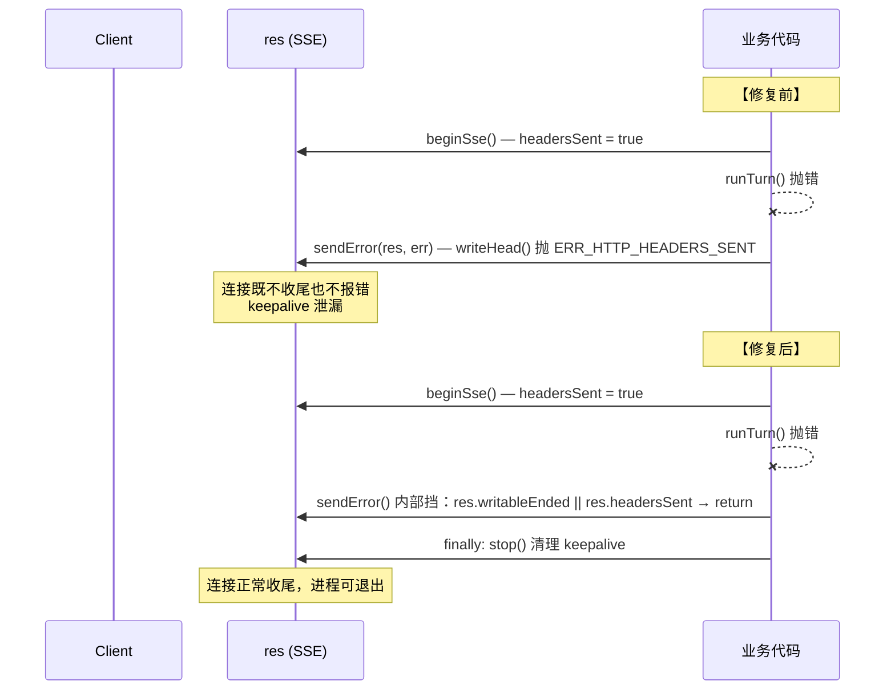

# 代码评审摘要：`dsh-biz-bridge`（含 4 个复审缺陷修复 + 并发安全加固）

## 1. 高级摘要（TL;DR）

*   **影响：🔴 高** — 闭环了 4 个复审遗留缺陷（F1–F4），并修正了 1 个会导致 500 错误污染告警的会话查询 bug，影响全部调试端点、stream 提交路径与 session 消息查询接口。
*   **核心变更：**
    *   🐛 **F1 修复**：回调测试状态查询改为"admin 或该任务所属 client"双重所有权校验（`requireTaskOwned`），杜绝跨 client 读取。
    *   🐛 **F2 修复**：回调测试接收器改为"每次激活随机 32 字节内部令牌"鉴权，**仅插件调度器可写**，彻底关闭外部伪造投递的口子。
    *   🐛 **F3 修复**：`writeJson` / `sendError` 同时检查 `headersSent`；SSE 主流程外加 `try/finally` 保证 keepalive 必停、连接必收尾，杜绝 `ERR_HTTP_HEADERS_SENT` 自崩溃。
    *   🐛 **F4 修复**：SSE keepalive 调用 `unref()`，不再独自撑住事件循环，进程可正常退出。
    *   ⚡ **并发安全**：`RunHub` 新增原子 `reserve()` / `release()`（同步 check-and-set），消除"预检通过 → runTurn 标记 active"之间的竞态窗口；并发同会话稳定返回 409 `SESSION_BUSY`，不再 500。
    *   🐛 **404 而非 500**：`sessionMessagesOp` 用稳定 `code`（`SESSION_QUERY_SESSION_NOT_FOUND`）判定"会话不存在"，映射为 `NotFoundError`（404），避免污染 5xx 告警。
    *   🔌 **DSH 0.1.5 兼容**：`user/message` 事件 data 直接是 `UserMessage`，不再误读成 `{ message }` 包装（此前 user 消息被静默丢弃）。

---

## 2. 可视化概览（代码与逻辑地图）

### 2.1 整体业务流（按"复审缺陷编号"标注修复点）

```mermaid
graph TD
    subgraph "Stream 提交路径"
        A["handleStreamSubmit()"] -->|F5 新增原子占位| B["hub.reserve(sid)"]
        B -->|占位失败 409| BX["SESSION_BUSY"]
        B -->|占位成功 try/finally| C["runStreamTask()"]
        C --> D["入库 received"]
        D --> E["openAgent + runTurn"]
        E --> F["SSE chunk 实时转发"]
        F -->|F3/F4 修复| G["finally: stop() + keepalive.unref()"]
        G --> H["finally: hub.release()"]
    end

    subgraph "Callback 调度（修复 F2）"
        S1["CallbackScheduler.postJson()"] -->|isCallbackTestReceiver?| S2{"是本插件测试接收器？"}
        S2 -->|"是 (内部可信)"| S3["headers[x-bridge-internal-token] = runtime.callbackTestToken"]
        S2 -->|"否 (业务方 URL)"| S4["不携带令牌（避免泄漏）"]
    end

    subgraph "HTTP 接收器（修复 F1/F2）"
        R1["POST /callback-test/receive"] -->|F2 验令牌| R2["runtime.callbackTestToken 匹配"]
        R2 -->|不匹配| R3["403 FORBIDDEN"]
        R2 -->|匹配| R4["写入 callbackTestStore"]
        Q1["POST /callback-test/{id}"] -->|F1 验归属| Q2["requireTaskOwned(db, taskId, caller)"]
        Q2 -->|非属主| Q3["403 FORBIDDEN"]
        Q2 -->|任务不存在| Q4["404 NOT_FOUND"]
        Q2 -->|admin 或 属主| Q5["返回 received"]
    end

    subgraph "Session 消息查询（修复 404/500 + DSH 0.1.5）"
        M1["POST /sessions/{id}/messages"] -->|宽松匹配字面量与%3A| M2["decodeSessionIdParam()"]
        M2 --> M3["sessionMessagesOp()"]
        M3 --> M4["readSessionOr404()"]
        M4 -->|code === SESSION_QUERY_SESSION_NOT_FOUND| M5["404 NOT_FOUND"]
        M4 -->|其他错误| M6["500 INTERNAL（如实上抛）"]
        M4 --> M7["projectMessages(): 兼容 data 与 data.message 两种形状"]
    end
```



### 2.2 修复前后对比 — F3 SSE 错误收尾



---

## 3. 详细变更分析

### 3.1 核心：RunHub 原子占位（解决并发 500）

**文件：** `src/core/runner.ts`、`src/http/stream.ts`

*   **业务目标**：同会话多轮对话必须严格串行；旧实现"先预检、后在 `runTurn` 里标记 active"在 Node 单线程下也存在**两次并发预检都通过**的窗口，第二个请求会在 `openAgent` 撞上 DSH 的 `already owned by an active write handle` 而落 500。
*   **新方案**：
    *   `RunHub` 引入 `reserved: Set<string>`，提供 `reserve(sessionId)`（同步 check-and-set）与 `release(sessionId)`。
    *   `handleStreamSubmit()` 在 `validateSubmitInput` 之后立即 `hub.reserve(sid)`，失败直接 409；成功则在 `try/finally` 中 `release()`。
    *   `isBusy()` 同时检查 `active` 与 `reserved` 两个集合。

```typescript
// src/core/runner.ts
reserve(sessionId: string): boolean {
  if (this.active.has(sessionId) || this.reserved.has(sessionId)) return false
  this.reserved.add(sessionId)
  return true
}

// src/http/stream.ts
if (!runtime.hub.reserve(sid)) {
  sendError(res, new SessionBusyError(`session "${sid}" already has a running task`))
  return
}
try { await runStreamTask(runtime, input, sid, res) }
finally { runtime.hub.release(sid) }
```

---

### 3.2 复审缺陷修复

#### F1 — 回调测试状态查询跨 client 读取

**文件：** `src/http/http-api.ts`

*   旧实现只校验 `admin` scope，**任何持有签名凭证的 client 都能查任意任务的回调到达状态**。
*   新实现复用 `requireTaskOwned(db, taskId, caller)`：admin 直接放行；非 admin 必须 `task.client_id === caller.clientId`；任务不存在 404。

#### F2 — 回调测试接收器免签名导致伪造投递

**文件：** `src/index.ts`、`src/shared/runtime.ts`、**新文件** `src/shared/callback-test.ts`、`src/core/scheduler.ts`、`src/http/http-api.ts`

*   旧实现 `/callback-test/receive` 免签名，任何能连到端口的人都能 POST 假投递。
*   新实现：
    1.  插件激活时 `randomBytes(32).toString('hex')` 生成 `callbackTestToken`，**只存于内存**。
    2.  调度器 `postJson()` 在目标 URL 命中 `isCallbackTestReceiver(url)`（即 `pathname === '/bizbridge/api/v1/callback-test/receive'`）时附带 `X-Bridge-Internal-Token` 头。
    3.  接收器 `handleCallbackTestReceive` 校验该头，不匹配一律 403 `FORBIDDEN`。
    4.  业务方 `callback_url` 绝不携带令牌，避免外泄。

| 端点 | 旧权限 | 新权限 |
|------|--------|--------|
| `POST /callback-test/receive` | 免签名 | 仅插件调度器（内部令牌） |
| `POST /callback-test/{id}` | admin | admin **或** 该任务所属 client |

#### F3 — `ERR_HTTP_HEADERS_SENT` 自崩溃 + SSE keepalive 泄漏

**文件：** `src/http/http-util.ts`、`src/http/stream.ts`

*   旧 `writeJson` / `sendError` 只判 `res.writableEnded`，SSE 已 `beginSse()` 发送响应头时再 `writeHead()` 会抛 `ERR_HTTP_HEADERS_SENT`，导致错误处理路径自身崩溃、连接既不收尾也不报错。
*   修复：`if (res.writableEnded || res.headersSent) return`。
*   同时 SSE 主流程包 `try { runTurn + 落库 } finally { stop() }`，确保 keepalive 必然清理。

#### F4 — keepalive 阻止进程退出

**文件：** `src/http/stream.ts`

*   `setInterval(..., SSE_KEEPALIVE_MS)` 默认 ref 状态，会独自撑住事件循环。修复：`keepalive.unref?.()`。

---

### 3.3 Session 消息查询：404 vs 500 + DSH 0.1.5 兼容

**文件：** `src/core/ops.ts`

*   **新工具函数**：

```typescript
function isSessionNotFoundError(error: unknown): boolean {
  return typeof error === 'object' && error !== null
    && (error as { code?: unknown }).code === 'SESSION_QUERY_SESSION_NOT_FOUND'
}

async function readSessionOr404(sessionQuery, sessionId) {
  try { return await sessionQuery.readSession(sessionId) }
  catch (error) {
    if (isSessionNotFoundError(error)) throw new NotFoundError(`session "${sessionId}" not found`)
    throw error  // 真实服务端故障如实上抛 → 500
  }
}
```

*   **DSH 0.1.5 兼容**：`user/message` 事件 `data` 自身就是 `UserMessage`，不再是 `{ message }` 包装。代码改为先探测 `.message`，两种形状都吃，避免 user 消息被静默丢弃。

---

### 3.4 URL 路由：路径参数支持百分号编码

**文件：** `src/http/http-api.ts`

*   旧正则 `^\/...\/sessions\/([A-Za-z0-9:._-]{1,128})\/messages$` 不接受 `%3A`（浏览器 `encodeURIComponent` 习惯把 `:` 编掉）。
*   新正则放宽为 `[A-Za-z0-9:._%-]{1,512}`，新增 `decodeSessionIdParam()`：含 `%` 才解码，**解码后**再按原字符集 1-128 校验，非法落 404。

---

### 3.5 运行时 / 类型 / 测试

| 维度 | 变更 |
|------|------|
| `BridgeRuntime` 接口 | 新增字段 `callbackTestToken: string`（`src/shared/runtime.ts`） |
| `package.json` | `test` 脚本追加 `tests/decode.test.ts`（`package.json`） |
| `tests/runner.test.ts` | 新增 2 个用例：`RunHub.reserve` 互斥 + 运行期/收敛期行为 |
| `tests/ops.test.ts` | 新增 4 个用例：消息投影 / 仅 admin / 404 / 真故障如实上抛 |
| `tests/auth.test.ts` | 修复时间戳竞态用例：`301` 边界值有秒级漂移风险，改用 `3600` 远越窗口 |
| `public/static/admin.html` | 任务行新增"会话消息"按钮；新增 `internalSessionId()` 辅助 |
| `public/static/index.html` | 简介追加"会话消息" |
| `public/static/utils.html` | 删除"预留小工具位"占位 section；更新 callback-test 权限描述 |

### 3.6 文档与发布

*   **`docs/api.md`** 新增 2 个端点章节：
    *   §12 `POST /api/v1/sessions/{id}/messages`（含 `<clientId>:<type>:<session_id>` ID 规则、`page`/`page_size` 参数、响应字段表、404/501/500 错误矩阵）
    *   §13 回调测试接收器（13.1 receive / 13.2 状态查询，标注"不是业务接口"）
*   **错误码全集更新**：移除 `SESSION_ACTIVATING`（已不再触发），`TASK_RUNNING` 改为并发抢占语义（可重试），新增 `NOT_IMPLEMENTED` (501)。
*   **`release/CHANGELOG.md`**：从长文改为按日下钻到 `release/logs/0.1.0-YYYYMMDD.md`，新增 `0.1.0-20260905` 历史日志文件。
*   **`release/dsh-biz-bridge-0.1.0.tgz`**：打包产物（仅体积变化，逻辑无侵入）。

---

## 4. 影响与风险评估

### 4.1 破坏性变更（Breaking Changes）

| 变更 | 旧行为 | 新行为 | 迁移建议 |
|------|--------|--------|----------|
| `POST /callback-test/receive` | 免签名 | 需 `X-Bridge-Internal-Token`，仅本进程调度器自带 | **业务方无影响**（该端点本就只服务于第一方页面） |
| `POST /callback-test/{id}` | admin 可查任意任务 | admin **或** 任务所属 client | 第一方页面需确保用 admin 或同 client 凭证调用 |
| `POST /sessions/{id}/messages` | 路径 `: ` 必须是字面量 | 同时接受 `%3A` 编码 | 兼容升级，无需客户端改动 |
| 错误码 `SESSION_ACTIVATING` | 仍会触发 | 仍保留在类型联合但**不再触发** | 客户端可保留兼容分支（无实际操作） |
| 错误码 `TASK_RUNNING` 语义 | "已开始执行" | "并发竞争未生效，可重试"（重播/取消/redeliver 三种场景） | 客户端**可重试**判定需扩展为同时覆盖"取消被调度抢占" |

### 4.2 行为变化

*   **stream 提交**：并发同会话现在稳定 409，不会再产生"预检都通过、第二个落 500 且白插一条任务"的脏数据。
*   **session 消息查询**：DSH 0.1.5 升级后，user 消息不再被静默丢弃（已修复 data 形状）。
*   **进程退出**：SSE 长连接处理完后事件循环不再被 keepalive 阻塞。

### 4.3 风险点

*   ⚠️ **`keepalive.unref?.()`**：依赖 Node ≥ 11.0 行为；项目本就 `target node22`，无问题。
*   ⚠️ **`decodeSessionIdParam`**：用 `raw.includes('%')` 判断是否需要解码；理论上含 `%` 但解码失败或解码结果仍非合法字符集会返回 `undefined` 落 404，**与"路由不存在"等价**，符合预期。
*   ⚠️ **`reserved` 集合与 `release` 必须配对**：`handleStreamSubmit` 已用 `try/finally` 保障；后续若新增入口直接调 `reserve`，**必须**自行配对 `release`，否则会话永久卡死（注释已显式提醒）。
*   ⚠️ **`callbackTestToken` 是单实例维度**：插件热重载或多 worker 部署会各持不同令牌；当前 DSH 调度器与 HTTP 接收器**同进程**，无影响，但跨进程场景需重新设计。

### 4.4 测试建议

复审者建议重点跑以下场景：

1.  **F1 跨 client 阻断**：用 client A 提交任务 → 用 client B 凭证去查 `POST /callback-test/{taskA_id}`，应 403。
2.  **F2 外部写入阻断**：直接 `curl -X POST /callback-test/receive -d '{}'`，应 403；带错误令牌头也应 403。
3.  **F3 SSE 异常收尾**：构造一个会让 `runTurn` 抛错的 stream 提交，验证响应连接在错误后**正常关闭**（无挂起 keepalive），且 Node 进程可在 idle 时自然退出。
4.  **F4 进程退出**：复现 stream 后立即 `process.exit()` 验证不会被 keepalive 阻塞。
5.  **并发占位**：用 `Promise.all` 提交两个同 `session_id` 的 stream 任务，**恰好一个**成功入库，另一个 409 `SESSION_BUSY`，DB 中只多 1 条任务。
6.  **404 vs 500**：调用 `POST /sessions/<不存在的id>/messages` 验证返回 404 `NOT_FOUND`；构造存储损坏（mock 抛 `SESSION_QUERY_CORRUPT_SESSION`）验证返回 500。
7.  **路径编码兼容**：分别用 `biz-a:stream:s1` 与 `biz-a%3Astream%3As1` 访问会话消息接口，均能命中路由。
8.  **DSH 0.1.5 user 消息投影**：在真机环境提交一个多轮对话，调接口验证 user 消息**全部出现**（不再被静默丢）。
9.  **auth 时间戳用例稳定性**：连跑 `tests/auth.test.ts` 10 次，验证 "Missing expected exception" 不再偶发。

---

### 附录：变更文件清单

| 类别 | 文件 |
|------|------|
| 核心 | `src/index.ts`、`src/core/runner.ts`、`src/core/scheduler.ts`、`src/core/ops.ts` |
| HTTP | `src/http/http-api.ts`、`src/http/http-util.ts`、`src/http/stream.ts` |
| 共享 | `src/shared/runtime.ts`、`src/shared/callback-test.ts`（新增） |
| 测试 | `tests/runner.test.ts`、`tests/ops.test.ts`、`tests/auth.test.ts` |
| 前端静态页 | `public/static/admin.html`、`public/static/index.html`、`public/static/utils.html` |
| 文档与发布 | `docs/api.md`、`package.json`、`release/CHANGELOG.md`、`release/logs/0.1.0-20260905.md`（新增）、`release/dsh-biz-bridge-0.1.0.tgz` |