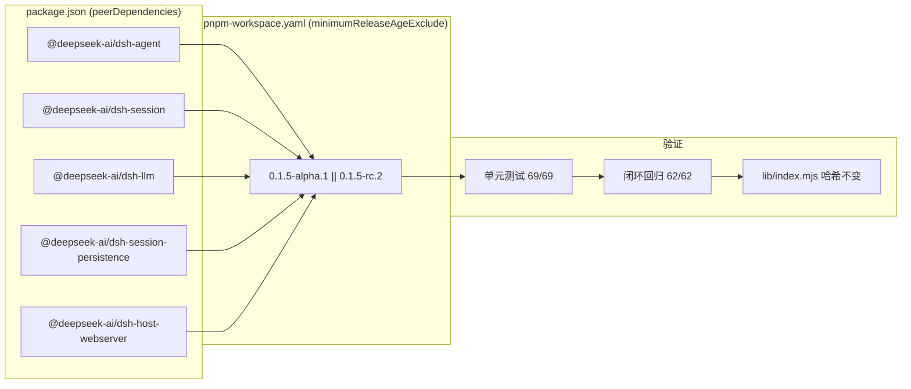

# 0.1.0 基线发布记录：DSH 0.1.5-rc.2 适配

> 本条记录与 `v0.1.0` 标签同一动作发出，作为插件 **0.1.0 草创完成基线**的发布说明。
> 版本仍为 `0.1.0`（开发者预览，接口可能调整，不建议用于生产关键链路）。

## 1. 高层摘要（TL;DR）

*   **影响等级：** 🟢 **低**（对插件自身行为）—— 本次是**依赖基线升级 + 回归覆盖补齐**，
    **功能源码零改动**。
*   **核心变更：**
    *   ⬆️ **依赖基线：** `package.json` 中 5 个 `@deepseek-ai/dsh-*` 的 `peerDependencies`
        由 `^0.1.5-alpha.1` 升级至 `^0.1.5-rc.2`。
    *   ⚙️ **pnpm 白名单：** `pnpm-workspace.yaml` 的 `minimumReleaseAgeExclude` 追加
        `|| 0.1.5-rc.2`（14 个包），使 RC 版本可绕过"最小发布年龄"检查被立即安装。
    *   🧪 **回归覆盖：** 闭环回归新增「模型目录 `/api/v1/models`」断言组（7 项）——
        该接口此前**完全没有被任何断言覆盖**，而它正是本轮上游唯一实质变更所在的面向。
    *   📦 **产物：** 重新打包 `release/dsh-biz-bridge-0.1.0.tgz`（内层 peers 已为 `^0.1.5-rc.2`）。
*   **验证结论：** 单元测试 **69/69 全绿**；闭环回归第 6 轮 **62 项断言全绿**
    （PASS 62 / FAIL 0 / SKIP 0）。
*   **上游破坏性变更：无。** 本插件绑定的 DSH 插件服务面在本轮 RC 中未发生破坏性变更。

---

## 2. 可视化总览

---

## 3. 详细变更分析

### 组件一：依赖声明（`package.json`）

5 个 DSH peer 统一升级，`@deepseek-ai/cordis` 与 `@deepseek-ai/schemastery`
因上游本窗口未变动而保持原区间：

| 依赖包 | 旧区间 | 新区间 |
| :--- | :--- | :--- |
| `@deepseek-ai/dsh-agent` | `^0.1.5-alpha.1` | `^0.1.5-rc.2` |
| `@deepseek-ai/dsh-session` | `^0.1.5-alpha.1` | `^0.1.5-rc.2` |
| `@deepseek-ai/dsh-llm` | `^0.1.5-alpha.1` | `^0.1.5-rc.2` |
| `@deepseek-ai/dsh-session-persistence` | `^0.1.5-alpha.1` | `^0.1.5-rc.2` |
| `@deepseek-ai/dsh-host-webserver` | `^0.1.5-alpha.1` | `^0.1.5-rc.2` |
| `@deepseek-ai/cordis` | `^4.0.2` | `^4.0.2`（不变） |
| `@deepseek-ai/schemastery` | `^3.18.2` | `^3.18.2`（不变） |

**区间语义（有意如此）：** `^0.1.5-rc.2` 等价于 `>=0.1.5-rc.2 <0.2.0`。
由于 semver 规定"预发布版本只在比较符本身带同 `major.minor.patch` 预发布标识时才匹配"，
实际效果是：

*   ✅ `0.1.5`（正式版）与 `0.1.5-rc.3`（同 patch 位的后续 RC）**均满足** —— 不会因官方转正而失效；
*   ❌ `0.1.6-rc.1`（下一个补丁位的 RC）**不满足** —— 迫使每次上游补丁位升级都留下一次
    显式的依赖变更，避免"静默漂移"。

所有 peer 均标记为 `optional`，宿主在运行时提供这些模块。

### 组件二：pnpm 工作区白名单与锁文件

*   `pnpm-workspace.yaml`：`minimumReleaseAgeExclude` 的全部 14 个条目追加 `|| 0.1.5-rc.2`
    （5 个直接 peer + 9 个传递依赖）。该白名单用于让刚发布、尚未满"最小发布年龄"的
    版本可被立即消费。
*   `pnpm-lock.yaml`：上述 5 个 peer 的 `specifier` / `version` 由 `0.1.5-alpha.1`
    解析到 `0.1.5-rc.2`；`cordis` / `schemastery` 解析结果不变。

### 组件三：回归覆盖（模型目录）

闭环回归新增 **T0 模型目录** 断言组（7 项）：

| 断言 | 目的 |
| :--- | :--- |
| `/api/v1/models` 返回 200 | 接口可用性 |
| provider `deepseek-official` 已注册 | 依赖的 provider 存在 |
| 模型目录非空 | 目录未退化为空 |
| 目录含官方默认模型 `deepseek-flash` | **上游漂移探测器** |
| 目录含基线模型 `deepseek-v4-flash` | 既有验证基线仍在 |
| 模型条目含 `id` / `name` | 插件直接透出的字段契约 |
| 存在可用于 agent 轮次的模型 | 后续轮次有可用模型 |

同时，后续 agent 轮次使用的模型改为**运行时从实测目录解析**（基线
`deepseek-v4-flash` 优先，若被上游移除则回退目录首项），避免模型改名时
数十条断言级联失败、掩盖真正的问题。

**为何要补：** 本轮上游 RC 的**唯一实质变更就在模型目录**，而此前闭环回归只覆盖
HTTP 契约与业务流程，`/api/v1/models` 一条断言都没有——属于"变更点恰好落在盲区"。

### 组件四：发布记录与产物

*   `release/CHANGELOG.md` 新增 `0.1.0-20260911` 索引条目（本文件）。
*   `release/dsh-biz-bridge-0.1.0.tgz` 重新打包。已解包核验：内层 `package.json`
    的 `version` 为 `0.1.0`，5 个 DSH peer 均为 `^0.1.5-rc.2`。

---

## 4. 上游 DSH 变更评估

评估窗口：`dsh-v0.1.5-alpha.1`（09-08）→ `alpha.2`（09-09）→ `rc.1`（09-10）→ `rc.2`（09-10）。

上游仓库内**不存在 `CHANGELOG` 或发布说明文件**，因此以 tag 间源码 / 整棵 `src/` 树哈希
比对为准。结论如下。

### 4.1 本插件绑定的服务面：无破坏性变更

| 本插件使用的面 | 上游变更 | 破坏性 |
| :--- | :--- | :--- |
| `ctx.agents`（create / resume / get、AgentHandle） | 源码零变化 | — |
| `ctx.webServer`（register / host / port） | 源码零变化 | — |
| `ctx.sessionQuery.readSession` 与 `SESSION_QUERY_SESSION_NOT_FOUND` | 树哈希四个 tag 全同 | — |
| `ctx.sessionPersistence.stat` | 仅 JSDoc 注释 | — |
| `ctx.llm.listProviders` | 返回类型 `LlmProviderInfo{id,name}` 未变 | — |
| `dsh-session` 事件模型（`session/event`、v3 `AssistantStreamRecord`） | 仅新增 2 个事件类型 | 否（增量） |
| `ctx.llm` 能力目录 | 新增 `LlmConfigurableProvider.error?` 可选字段 | 否（增量） |
| `cordis` 4.0.2 / `schemastery` 3.18.2 | 树哈希不变 | — |

新增的 2 个会话事件类型（`deliverables/presented`、`subagent/catalog`）由插件的
事件解码隔离层防御性忽略（未知类型返回空集），无需适配。

### 4.2 唯一的实质变更：LLM 模型目录

`rc.1` 中：

*   官方 `llm-deepseek` 的默认目录**新增首项** `deepseek-flash`（DeepSeek-V41-Flash，支持文本+图像）；
    **原有 `deepseek-v4-flash` / `deepseek-v4-pro` / `deepseek-v4-flash-vision-exp` 全部保留**。
*   官方 base bundle 的默认模型由 `deepseek-v4-flash` 改为 `deepseek-flash`。

**对本插件的影响：**

*   `/api/v1/models` 会自动透出新模型，无需改代码；
*   调用方**省略** `params.provider` / `params.model` 时，将由宿主默认模型（现为
    `deepseek-flash`）承接；**显式传参不受影响**。业务方若需固定模型，请显式传入。

### 4.3 `rc.2` 相对 `rc.1`

几乎为纯版本号：`packages/` 下排除客户端（`packages/client/**`）后，**唯一源码改动是
一行 JSDoc**。对插件无影响。

### 4.4 已核验但不在本插件使用范围内

上游 `@deepseek-ai/dsh-api-workspace-files` 在本窗口存在**破坏性变更**（读方法首参
由 `Agent` 改为 `WorkspaceFileScope`，并放宽读取范围）。本插件**不使用**该 Remote——
其参考页由插件自己的 `/bizbridge/static` 前缀路由提供，不是 DSH 客户端插件——故无影响。
另有反馈（feedback）、子代理（subagent）等新增/变更能力，本插件同样不涉及。

---

## 5. 影响与验证

### 兼容性

*   **对插件自身：无行为变化。** 重新构建后 `lib/index.mjs` 哈希与升级前**完全一致**
    （`E72D2EC712B7D305F0C618BDBE0327DF5F27C130AC37E4B80EB72521AACCEFB5`，117,833 B），
    即本次适配未触碰任何功能源码。
*   **对下游使用者：** peer 标记为 `optional`，宿主在运行时提供 DSH 模块；
    升级不引入新的运行时依赖。

### 已执行的验证

| 项目 | 结果 |
| :--- | :--- |
| 单元测试（`pnpm test`） | **69 / 69 全绿** |
| 闭环回归（第 6 轮，重装 + 重启后） | **PASS 62 / FAIL 0 / SKIP 0** |
| 部署产物一致性 | 部署 `lib/index.mjs` 哈希与本地构建一致 |
| 依赖解析 | 部署侧 `package.json` 与 profile 锁文件均记录 `^0.1.5-rc.2` |
| 实测模型目录 | `[deepseek-flash, deepseek-v4-flash, deepseek-v4-pro, deepseek-v4-flash-vision-exp]`，与官方源码逐项吻合 |
| 原有 55 项回归 | 全部无回归（流式与 usage 一致性、回调投递与重投、并发串行 409、双客户端隔离、会话消息、调试端点权限） |

---

## 6. 基线说明

*   本记录对应的插件版本为 **0.1.0**，DSH 基线为 **0.1.5-rc.2**。
*   按既定版本策略，**DSH 发布 1.x 之前插件不出正式版**；后续每次跟随上游升级
    以 0.1.x 递增。
*   维护节奏：**上游出新版本 → 升级 peer 区间 → `pnpm test` → 重新打包 →
    重装 profile 并重启 → 执行闭环回归**。
